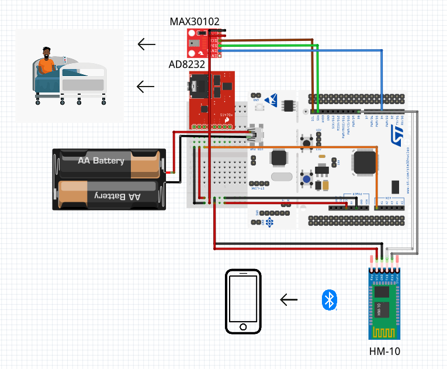
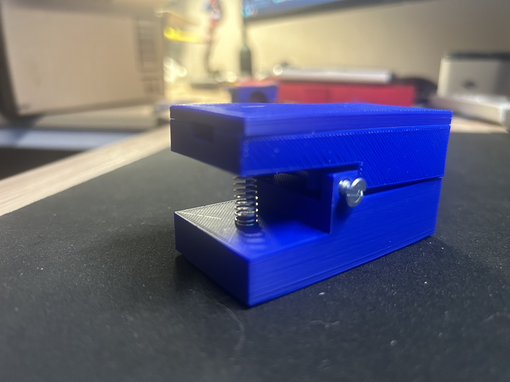
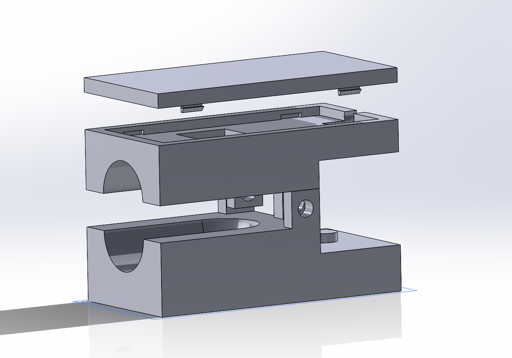
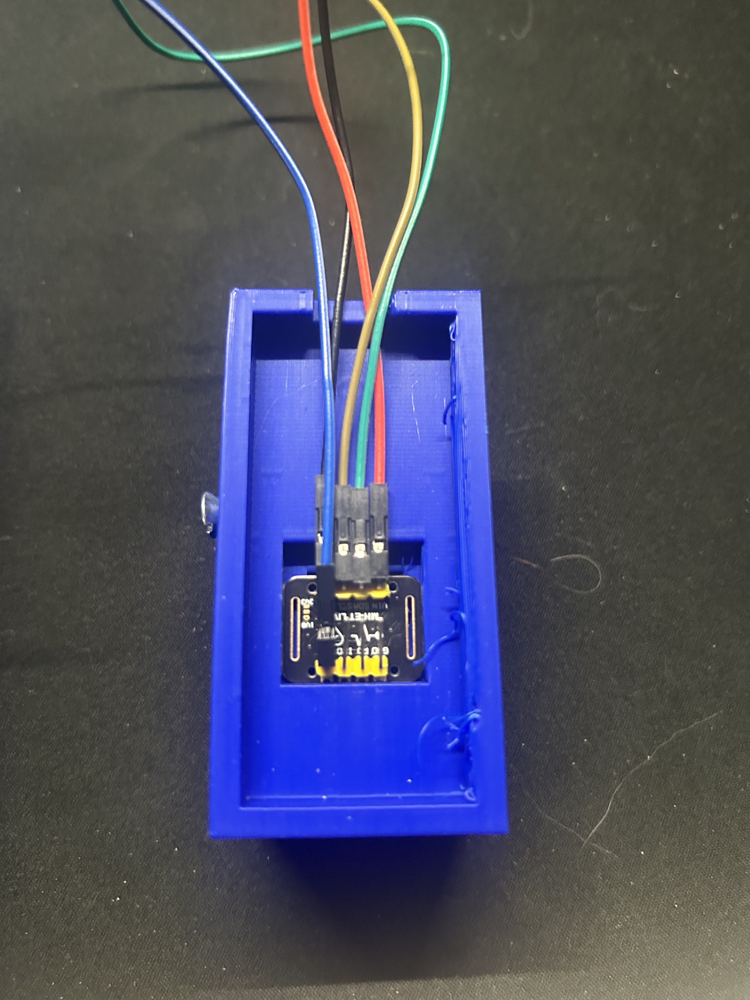

# STM32 Bluetooth Heart Monitor * NOT FOR MEDICAL USE*

This was my **Honors Directed Study project at Henry Ford College**, this was a semester long project done over the span of about 3 months being mentored by a professor at HFC.  
The goal was to build a working heart monitor from scratch using an STM32F466RE microcontroller, a few biomedical sensors, and Bluetooth to send data to a mobile app. I also designed a 3D printed case to hold everything together.

---

## Demo
Quick 15-second demo of the system in action:  
  
*(Shows real-time sensor data being sent over Bluetooth and displayed in the iOS app.)*

---

## What it does
- Reads ECG (heart activity) and SpO2 (oxygen levels)  
- Runs STM32 firmware in C using HAL  
- Sends data over Bluetooth using an HM-10 module  
- Displays the data on an iOS app I built with Flutter  
- All packed into a custom 3D-printed enclosure  

---

## Repository layout
- `/stm32code` - STM32 firmware (C language)  
- `/flutterapp` - iOS Flutter app
- `/solidworks-files` - 3D design files and STLs for the enclosure
- `/images` - Misc images of the completed project

---

## Hardware
- STM32F466RE microcontroller  
- MAX30102 pulse oximeter / heart rate sensor  
- AD8232 ECG front-end  
- HM-10 Bluetooth LE module  
- 3D-printed enclosure  

---

## Firmware
Code is in `/stm32code`.  
- Initializes and reads sensor data  
- Talks to sensors over I2C  
- Formats data for Bluetooth transfer  

---

## Mobile App
Code is in `/flutterapp`.  
- Connects over BLE and plots live data  
- Built as a quick proof of concept with no prior Flutter experience  
- Not actively maintained (requires macOS build environment)  
- Demo available in video above

## How to run it
1. Clone the repo  
2. Flash the firmware from `/stm32code` onto the STM32F466RE board  
3. Wire up sensors and the HM-10 module (see wiring diagram in `/images`)  
4. Pair over BLE and view the data (with the Flutter app)

## Images

### System Flow Diagram

### Printed Device

### Full Equipment Layout

### 3D Render

### Pulse Ox Enclosure with Sensor

---

## Notes
- This project was part of an **Honors Directed Study at Henry Ford College**, completed over a 3-month period.  
- The 3D-printed enclosure was limited by available material at the time.  
- It was a learning project and is not intended for clinical or diagnostic use.  
- The code and files are provided as-is. If anyone tries to reuse this project, please don’t expect ongoing support or bug fixes.  
